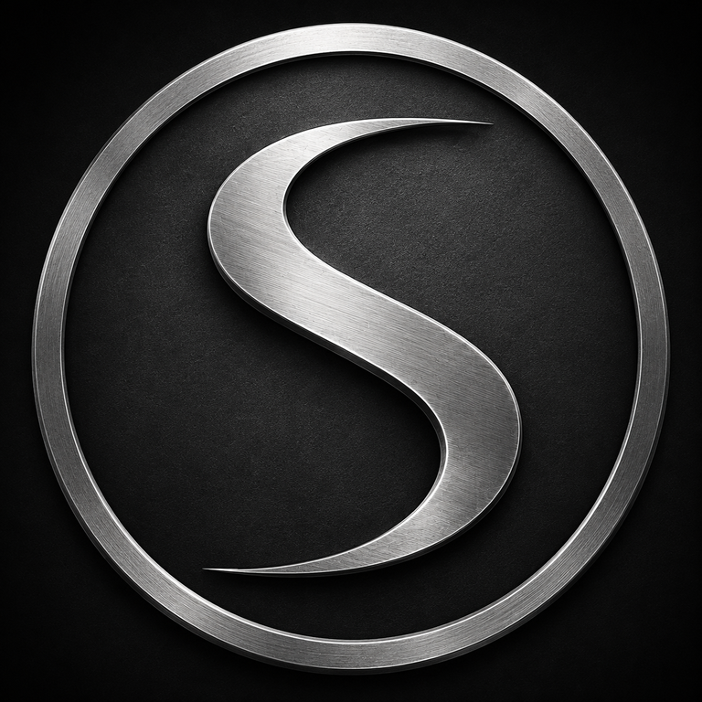
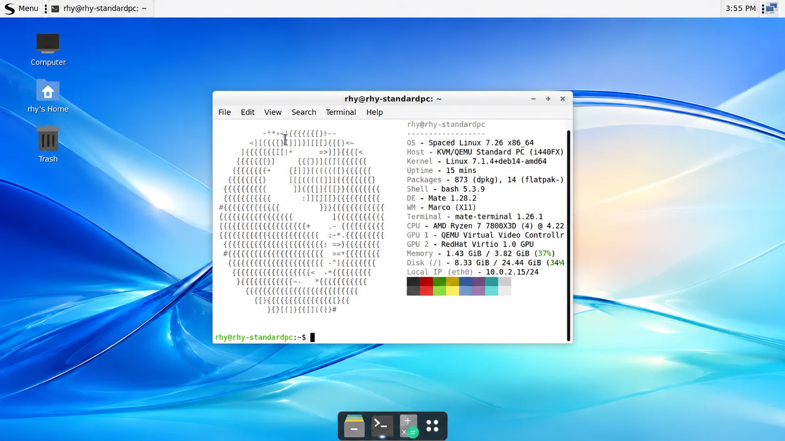
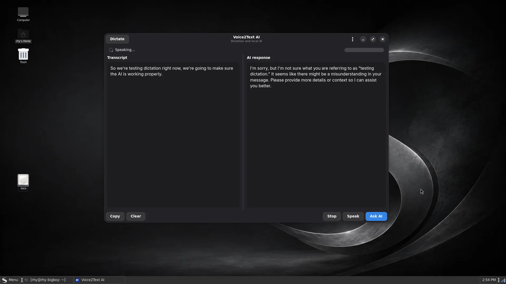
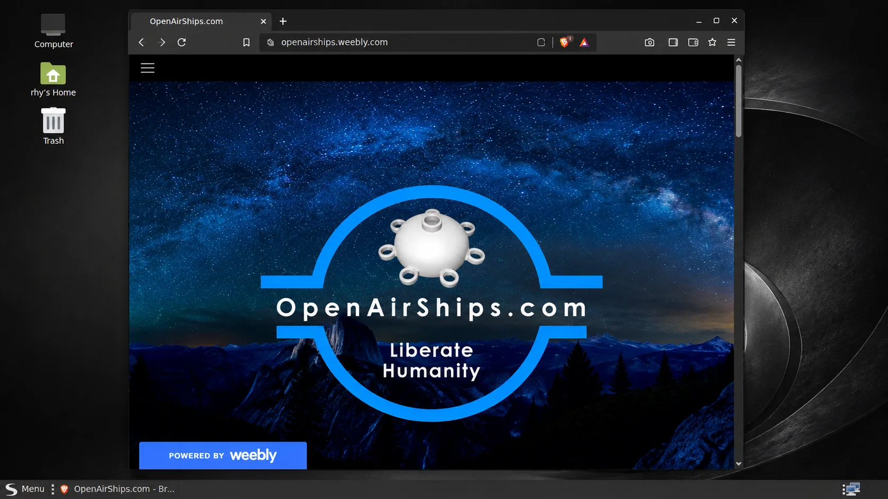
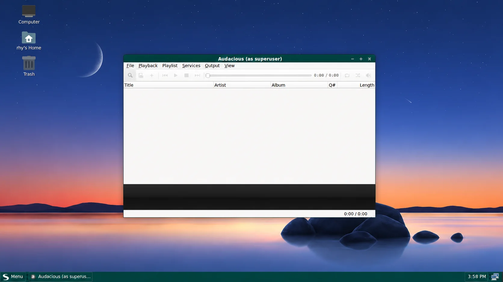
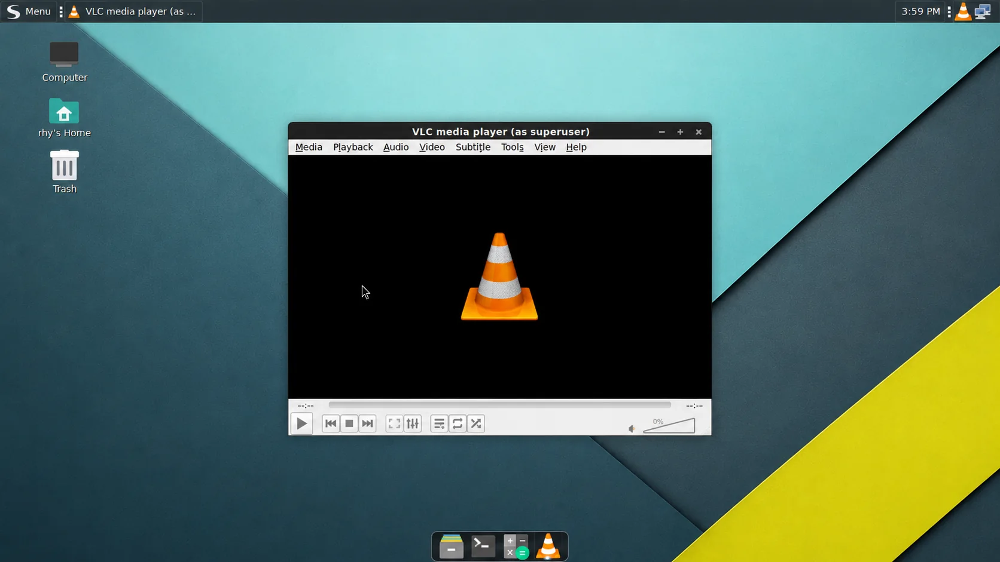
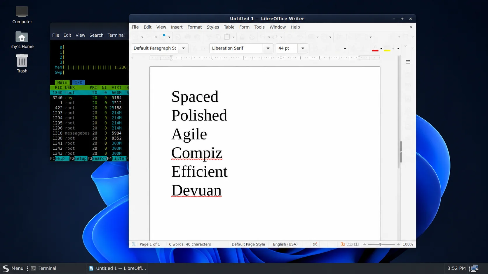
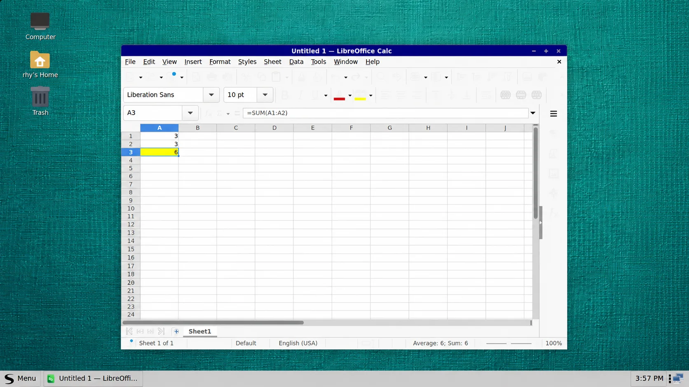
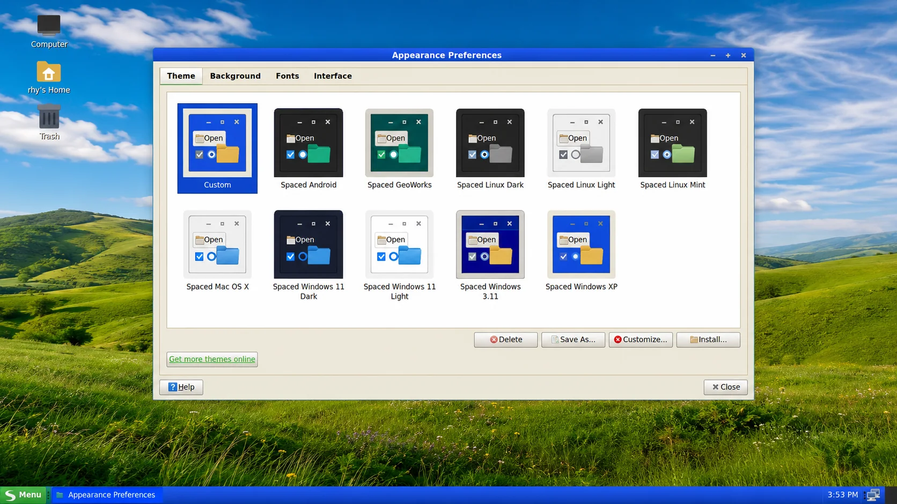

<p align="center">
  <a href="https://spacedlinux.com">
    
  </a>
</p>

<h1 align="center">Spaced Linux 7.26.4</h1>

<p align="center"><strong>Spaced. Polished. Agile. Compiz. Efficient. Devuan.</strong></p>

<p align="center">
  A beautiful, familiar, systemd-free Linux desktop for beginners, power users,<br>
  and anyone who wants their computer to feel like their own.
</p>

<p align="center">
  <a href="https://spacedlinux.com"><strong>Website</strong></a> ·
  <a href="https://github.com/crhy/spaced/releases/tag/v7.26.4"><strong>Download 7.26.4</strong></a> ·
  <a href="https://github.com/crhy/spaced/issues"><strong>Issues</strong></a> ·
  <a href="docs/DESIGN.md"><strong>Design</strong></a> ·
  <a href="#support-spaced-linux"><strong>Support</strong></a>
</p>

<p align="center">
  
  
  
  
  
  
  
</p>

<p align="center">
  <a href="website/assets/screenshots/desktop-terminal.webp">
    
  </a>
</p>

## Linux that feels familiar. Freedom that goes deeper.

Spaced Linux is a polished desktop distribution built on **Devuan Ceres**, using **sysvinit**, **MATE**, and **Compiz**. It welcomes first-time Linux users without hiding the system from experienced users who want to inspect, customize, automate, and rebuild it.

The desktop begins with a familiar layout: a clear application menu, conventional windows, readable controls, and tools placed where people expect them. Beneath that approachable surface is a lean Devuan base, a deeply configurable Compiz desktop, Flatpak and Flathub integration, a graphical Calamares installer, and a reproducible live-build workflow.

Compiz is not an optional novelty. It is the primary window manager and compositor, providing smooth animation, flexible workspace behavior, window rules, accessibility features, and the visual personality that makes Spaced Linux feel alive. Marco remains available as a dependable fallback.

## Spaced Linux in action

These are real Spaced Linux desktop sessions—not wallpaper mockups. Click any image to view it at full size.

<table>
  <tr>
    <td width="50%" align="center">
      <a href="website/assets/screenshots/desktop-ai-tools.webp"></a><br>
      <sub><strong>Modern AI tools</strong> — Voice 2 Text with local model integration.</sub>
    </td>
    <td width="50%" align="center">
      <a href="website/assets/screenshots/desktop-browser.webp"></a><br>
      <sub><strong>Web browsing</strong> — A clean desktop for everyday online work.</sub>
    </td>
  </tr>
  <tr>
    <td width="50%" align="center">
      <a href="website/assets/screenshots/desktop-music.webp"></a><br>
      <sub><strong>Music</strong> — Lightweight playback with a classic desktop workflow.</sub>
    </td>
    <td width="50%" align="center">
      <a href="website/assets/screenshots/desktop-video.webp"></a><br>
      <sub><strong>Video</strong> — VLC and modern Flatpak applications fit naturally.</sub>
    </td>
  </tr>
  <tr>
    <td width="50%" align="center">
      <a href="website/assets/screenshots/desktop-writer.webp"></a><br>
      <sub><strong>Word processing</strong> — LibreOffice Writer with a familiar windowed layout.</sub>
    </td>
    <td width="50%" align="center">
      <a href="website/assets/screenshots/desktop-spreadsheet.webp"></a><br>
      <sub><strong>Spreadsheets</strong> — Productive desktop software without systemd.</sub>
    </td>
  </tr>
  <tr>
    <td width="50%" align="center">
      <a href="website/assets/screenshots/desktop-themes.webp"></a><br>
      <sub><strong>Coordinated themes</strong> — Switch the complete desktop personality together.</sub>
    </td>
    <td width="50%" align="center">
      <a href="website/assets/screenshots/desktop-terminal.webp"></a><br>
      <sub><strong>Transparent and inspectable</strong> — A Linux system that remains yours.</sub>
    </td>
  </tr>
</table>

## Why beginners feel at home

| Feature | Benefit |
|---|---|
| **Familiar desktop** | A classic desktop workflow avoids the learning curve of unfamiliar shells. |
| **Graphical installation** | Calamares provides a clear installation path for BIOS and UEFI systems. |
| **Useful defaults** | Networking, audio controls, archives, editing, document viewing, and system utilities are ready immediately. |
| **Modern applications** | Flatpak and Flathub provide current desktop apps without destabilizing the base system. |
| **Coordinated themes** | One choice can change the GTK theme, icons, folder colors, wallpaper, panel layout, and optional dock together. |
| **Safe fallback** | Marco is available when Compiz is unsuitable for a GPU, VM, or specialized workflow. |

## Why advanced users keep control

| Feature | Benefit |
|---|---|
| **Systemd-free architecture** | Devuan Ceres and sysvinit keep service management conventional, understandable, and scriptable. |
| **APT plus Flatpak** | Use native packages for the operating system and sandboxed apps for fast-moving desktop software. |
| **Deep Compiz configuration** | Tune effects, window rules, workspaces, keybindings, accessibility, and compositor behavior. |
| **Reproducible builds** | The repository contains the live-build configuration, package selection, overlays, scripts, and QEMU targets used to make the ISO. |
| **Plain-text configuration** | Themes, package groups, desktop defaults, and automation remain inspectable and version controlled. |
| **A practical customization base** | Fork it, rebuild it, replace the artwork, alter package groups, or turn it into another focused distribution. |

## A desktop with range

Spaced Linux combines a modern system with visual ideas from the best desktop eras. Its theme collection can evoke classic Windows, macOS, Android, Linux Mint, GeoWorks, or the distinctive monochrome Spaced identity without becoming a fragile pile of unrelated tweaks.

<p align="center">
  <a href="website/assets/screenshots/desktop-themes.webp">
    
  </a>
</p>

## Core components

- **Base:** Devuan Ceres 7 “Freia,” rolling release
- **Init:** sysvinit
- **Desktop:** MATE
- **Primary window manager:** Compiz
- **Fallback window manager:** Marco
- **File manager:** Caja
- **Application menu:** Brisk Menu
- **Display manager:** LightDM GTK Greeter
- **Installer:** Calamares
- **Icons:** Spaced overlays based on Papirus
- **Application delivery:** APT plus Flatpak/Flathub
- **Target architecture:** amd64

## Download Spaced Linux 7.26.4

Download the ISO and checksum files from the [Spaced Linux 7.26.4 release](https://github.com/crhy/spaced/releases/tag/v7.26.4).


**SHA-256**

```text
0e864c967fa1fd19b55df8298218fdaef5215915dd3addcc4e17135535307321  spaced-linux-7.26.4-amd64.iso
```

Verify the download on Linux:

```bash
sha256sum -c spaced-linux-7.26.4-amd64.iso.sha256
```

Test release images in a virtual machine or on non-critical hardware before adopting them for daily use.

## Build Spaced Linux

A Devuan- or Debian-based build host is recommended.

```bash
git clone https://github.com/crhy/spaced.git
cd spaced
make deps
make release
```

The completed ISO is written beneath:

```text
build/iso/
```

### Test in QEMU

```bash
make iso-test
```

### Useful targets

```bash
make check
make help
make deps
make iso-build
make iso-test
make vm-start
make release
make clean
make cache-clean
```

QEMU defaults to a 1440×900 GTK window and forwards guest SSH to port `2222`.

## Support Spaced Linux

Spaced Linux is an independent project. Donations help cover hosting, testing, hardware, development time, and future releases.

<table>
  <tr>
    <td width="50%" align="center" valign="top">
      <a href="https://mempool.space/address/bc1q3kgsasmwyc2knfa8snzqstr7m983sxwleql7l2">
        
      </a><br>
      <strong>Bitcoin</strong><br>
      <code>bc1q3kgsasmwyc2knfa8snzqstr7m983sxwleql7l2</code>
    </td>
    <td width="50%" align="center" valign="top">
      <a href="https://venmo.com/u/green-jacket">
        
      </a><br>
      <strong>Venmo</strong><br>
      <code>@green-jacket</code>
    </td>
  </tr>
</table>

Thank you for helping keep an independent, polished, systemd-free desktop available to everyone.

## Project status

The current release line is **7.26.4**. Spaced Linux is an independent community project under active development.

## Contributing

Bug reports, documentation improvements, Compiz refinements, theme work, package suggestions, hardware testing, accessibility improvements, and build fixes are welcome.

Open an [issue](https://github.com/crhy/spaced/issues) or submit a pull request describing what changed and how it was tested.

## Acknowledgements

Spaced Linux builds on the work of the Devuan, Debian, MATE, Compiz, Calamares, Flatpak, Papirus, and broader free-software communities.

## License

Project-specific build configuration and code are released under the [MIT License](LICENSE). Upstream packages, artwork, themes, fonts, and components retain their respective licenses.
