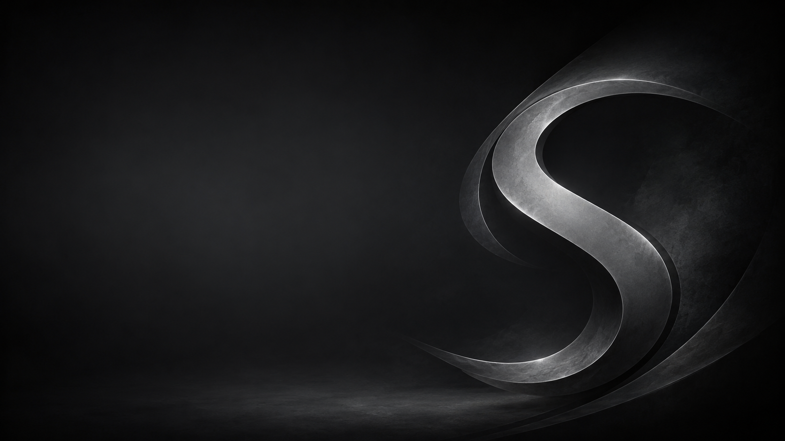

<p align="center">
  
</p>

<h1 align="center">Spaced Linux 7.26</h1>

<p align="center">
  <strong>A polished, Compiz-powered, systemd-free desktop built on Devuan Ceres.</strong>
</p>

<p align="center">
  <a href="https://spacedlinuxorg.square.site">Website</a>
  ·
  <a href="https://github.com/crhy/spaced/releases">Releases</a>
  ·
  <a href="https://github.com/crhy/spaced/issues">Issues</a>
</p>

<p align="center">
  
  
  
  
  
  
</p>

<p align="center">
  
</p>

## What is Spaced Linux?

Spaced Linux is a lightweight Devuan-based desktop distribution designed to feel immediately familiar without giving up the simplicity of a systemd-free system. It combines a rolling Devuan Ceres foundation with the MATE desktop, Compiz as the primary window manager and compositor, a carefully coordinated monochrome theme, and a classic single-panel workflow.

Compiz is central to the Spaced Linux experience rather than an optional visual add-on. It provides the compositing, desktop effects, animations, and flexible window behavior that give the distribution much of its personality. Marco remains available as a dependable fallback for hardware or situations where Compiz is not appropriate.

The goal is a practical desktop that looks finished, stays understandable, and is useful from the first boot—whether it is running on everyday hardware, inside a virtual machine, or as a customizable base for another system.

## Highlights

| | |
|---|---|
| **Systemd-free** | Devuan Ceres with `sysvinit` |
| **Compiz-first desktop** | Compositing, effects, animations, and flexible window management |
| **Reliable fallback** | Marco remains available when Compiz is unsuitable |
| **Familiar workflow** | MATE with a single WinXP-style bottom panel |
| **Eleven distinct themes** | Independent GTK/window palettes, wallpapers, and folder colors over Papirus Dark |
| **Straightforward menu** | Brisk Menu with Spaced Linux branding |
| **Modern applications** | Flatpak and Flathub integration |
| **Graphical installation** | Calamares installer |
| **Everyday connectivity** | NetworkManager, PulseAudio, and Pavucontrol |
| **Reproducible images** | Automated `live-build` workflow with QEMU test target |

## The desktop experience

Spaced Linux keeps the workflow familiar while using Compiz to make the desktop more capable and expressive:

- Compiz is the primary window manager and compositor;
- configurable desktop effects and animations are integrated into the intended experience;
- Marco is retained as a stable fallback option;
- one bottom panel replaces multiple bars or docks;
- the panel provides the application menu, window list, notification area, clock, and show-desktop control;
- a restrained black-and-gray visual identity ties together the desktop, login screen, installer, and boot presentation;
- Flatpak support provides current desktop applications without replacing the Devuan base.

<table>
  <tr>
    <td width="68%"></td>
    <td width="32%"></td>
  </tr>
  <tr>
    <td align="center"><sub>Spaced Linux desktop artwork</sub></td>
    <td align="center"><sub>Simplified boot and installer artwork</sub></td>
  </tr>
</table>

## Core components

- **Base:** Devuan Ceres, rolling release
- **Init:** sysvinit
- **Desktop environment:** MATE
- **Primary window manager and compositor:** Compiz
- **Fallback window manager:** Marco
- **File manager:** Caja
- **Menu:** Brisk Menu
- **Display manager:** LightDM with the GTK greeter
- **Installer:** Calamares
- **Icons:** Per-theme folder overlays inheriting Papirus Dark
- **Application delivery:** APT plus Flatpak/Flathub
- **Target architecture:** amd64

## Build the ISO

A Devuan or Debian-based build host is recommended.

```bash
git clone https://github.com/crhy/spaced.git
cd spaced
make deps
make release
```

The completed ISO is written beneath:

```text
build/iso/
```

### Test the ISO in QEMU

```bash
make iso-test
```

### Build with Docker

```bash
docker build -t spaced-linux-builder .
docker run --privileged -v "$(pwd)/build:/build" spaced-linux-builder
```

## Useful build targets

```bash
make check
make help       # List available targets
make deps       # Install build dependencies
make iso-build  # Build the live ISO
make iso-test   # Boot the ISO and reusable install disk in GTK QEMU
make vm-start   # Boot the installed KVM disk
make release    # Clean and build a release ISO
make clean      # Remove generated build artifacts, retaining package cache
make cache-clean # Remove the live-build package cache
```

QEMU defaults to a 1440×900 GTK window and forwards guest SSH to port 2222.
Override a busy port with `make iso-test VM_SSH_PORT=2223`.

## Project status

The current version line is **7.26**. Spaced Linux is an independent community project and remains under active development. Test release images on non-critical hardware or in a virtual machine before relying on them for daily work.

For the visual overview and project presentation, visit the [Spaced Linux website](https://spacedlinuxorg.square.site).

## Contributing

Bug reports, documentation improvements, Compiz configuration refinements, theme improvements, package suggestions, and build fixes are welcome. Open an [issue](https://github.com/crhy/spaced/issues) or submit a pull request with a clear description of the change and how it was tested.

## Acknowledgements

Spaced Linux builds on the work of the Devuan, Debian, MATE, Compiz, Calamares, Flatpak, Papirus, and broader free-software communities.

## License

The build configuration and project-specific code in this repository are released under the [MIT License](LICENSE). Individual upstream packages, themes, and components retain their own licenses.
