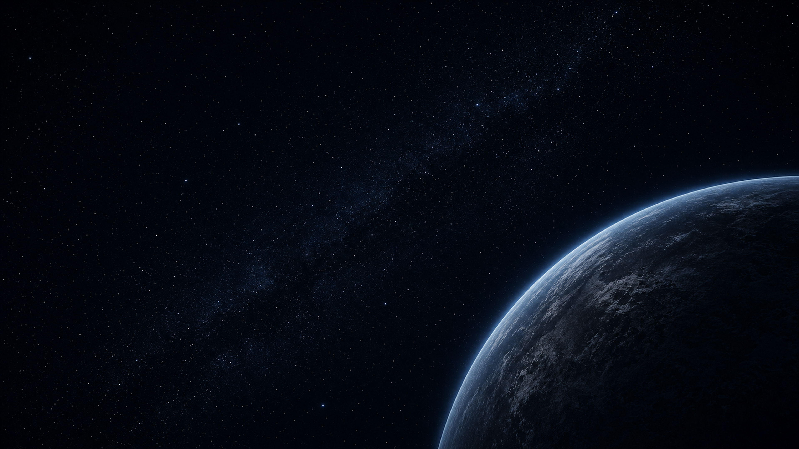
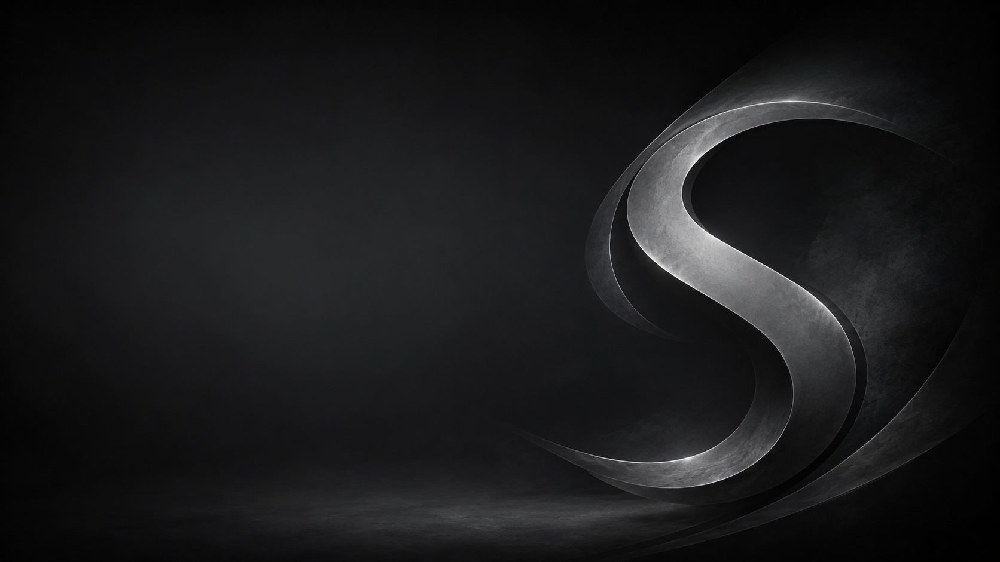
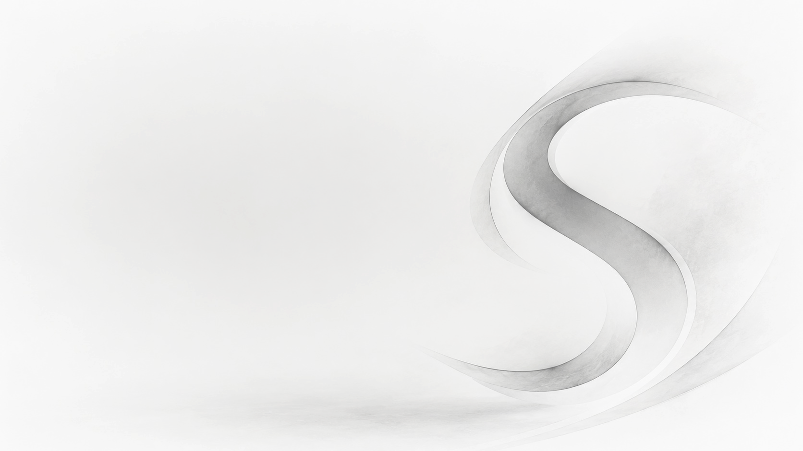

<p align="center">
  
</p>

<h1 align="center">Spaced Linux 7.26</h1>

<p align="center"><strong>Spaced. Polished. Agile. Compiz. Efficient. Devuan.</strong></p>

<p align="center">
A beautiful, familiar, systemd-free Linux desktop for beginners, power users, and anyone who wants their computer to feel like their own.
</p>

<p align="center">
  <a href="https://spacedlinux.com"><strong>Website</strong></a> ·
  <a href="https://github.com/crhy/spaced/releases"><strong>Downloads</strong></a> ·
  <a href="https://github.com/crhy/spaced/issues"><strong>Issues</strong></a> ·
  <a href="docs/DESIGN.md"><strong>Design</strong></a>
</p>

<p align="center">
  
  
  
  
  
  
</p>

<p align="center">
  
</p>

## Linux that feels familiar. Freedom that goes deeper.

Spaced Linux is a polished desktop distribution built on **Devuan Ceres**, using **sysvinit**, **MATE**, and **Compiz**. It is designed to welcome first-time Linux users without hiding the system from experienced users who want to inspect, customize, automate, and rebuild it.

The desktop starts with a familiar layout: one bottom panel, a clear application menu, conventional windows, readable controls, and tools placed where people expect them. Underneath that approachable surface is a lean Devuan base, a deeply configurable Compiz desktop, Flatpak and Flathub integration, a graphical Calamares installer, and a reproducible live-build workflow.

Compiz is not an optional novelty. It is the primary window manager and compositor, providing smooth animation, flexible workspace behavior, window rules, accessibility features, and the visual personality that makes Spaced Linux feel alive. Marco remains available as a dependable fallback.

## Why beginners feel at home

| Feature | Benefit |
|---|---|
| **Familiar desktop** | A classic single-panel workflow avoids the learning curve of unfamiliar shells. |
| **Graphical installation** | Calamares provides a clear installation path for BIOS and UEFI systems. |
| **Useful defaults** | Networking, audio controls, archive tools, editing, document viewing, and system utilities are ready immediately. |
| **Modern applications** | Flatpak and Flathub provide current desktop apps without destabilizing the base system. |
| **Coordinated themes** | A single choice changes the GTK theme, icons, folder colors, wallpaper, panel layout, and optional dock together. |
| **Safe fallback** | Marco is available when Compiz is unsuitable for a GPU, VM, or specialized workflow. |

## Why advanced users keep control

| Feature | Benefit |
|---|---|
| **Systemd-free architecture** | Devuan Ceres and sysvinit keep service management conventional, understandable, and scriptable. |
| **APT plus Flatpak** | Use native packages for the operating system and sandboxed apps for fast-moving desktop software. |
| **Deep Compiz configuration** | Tune effects, window rules, workspaces, keybindings, accessibility, and compositor behavior. |
| **Reproducible builds** | The repository contains the live-build configuration, package selection, overlays, scripts, and QEMU targets used to make the ISO. |
| **Plain-text configuration** | Themes, package groups, desktop defaults, and automation remain inspectable and version controlled. |
| **A practical customization base** | Fork it, rebuild it, replace the artwork, alter package groups, or turn it into another focused distribution. |

## A desktop with range

Spaced Linux combines a modern system with visual ideas from the best desktop eras. Its theme collection can evoke classic Windows, macOS, Android, Linux Mint, GeoWorks, or the distinctive monochrome Spaced identity without becoming a fragile pile of unrelated tweaks.

<table>
  <tr>
    <td width="50%"></td>
    <td width="50%"></td>
  </tr>
  <tr>
    <td align="center"><sub>Spaced Dark</sub></td>
    <td align="center"><sub>Spaced Light</sub></td>
  </tr>
  <tr>
    <td></td>
    <td></td>
  </tr>
  <tr>
    <td align="center"><sub>Classic familiarity</sub></td>
    <td align="center"><sub>Dock-oriented workflow</sub></td>
  </tr>
</table>

## Core components

- **Base:** Devuan Ceres 7 “Freia,” rolling release
- **Init:** sysvinit
- **Desktop:** MATE
- **Primary window manager:** Compiz
- **Fallback window manager:** Marco
- **File manager:** Caja
- **Application menu:** Brisk Menu
- **Display manager:** LightDM GTK Greeter
- **Installer:** Calamares
- **Icons:** Spaced overlays based on Papirus
- **Application delivery:** APT plus Flatpak/Flathub
- **Target architecture:** amd64

## Build Spaced Linux

A Devuan- or Debian-based build host is recommended.

```bash
git clone https://github.com/crhy/spaced.git
cd spaced
make deps
make release
```

The completed ISO is written beneath:

```text
build/iso/
```

### Test in QEMU

```bash
make iso-test
```

### Useful targets

```bash
make check
make help
make deps
make iso-build
make iso-test
make vm-start
make release
make clean
make cache-clean
```

QEMU defaults to a 1440×900 GTK window and forwards guest SSH to port `2222`.

## Project status

The current release line is **7.26**. Spaced Linux is an independent community project under active development. Test release images in a virtual machine or on non-critical hardware before adopting them for daily use.

## Contributing

Bug reports, documentation improvements, Compiz refinements, theme work, package suggestions, hardware testing, accessibility improvements, and build fixes are welcome.

Open an [issue](https://github.com/crhy/spaced/issues) or submit a pull request describing what changed and how it was tested.

## Acknowledgements

Spaced Linux builds on the work of the Devuan, Debian, MATE, Compiz, Calamares, Flatpak, Papirus, and broader free-software communities.

## License

Project-specific build configuration and code are released under the [MIT License](LICENSE). Upstream packages, artwork, themes, fonts, and components retain their respective licenses.
