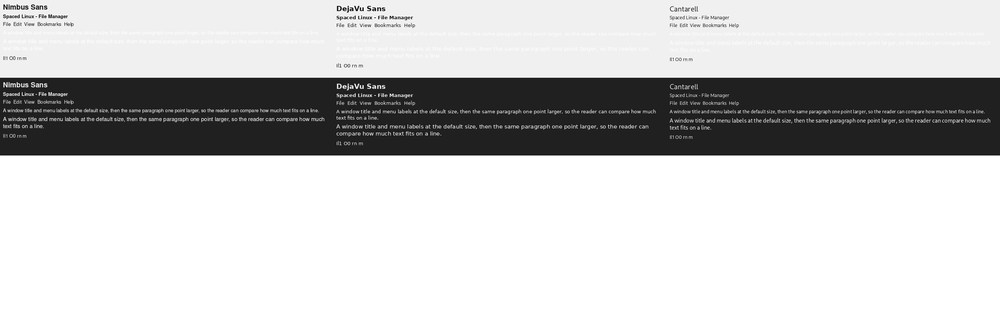

# Default font comparison (issue #286)

Width = pixels of the 60-character sentence at 10 pt (narrower fits more text). x-height = pixels of the lowercase 'x' at 10 pt.

| Family | Width (px) | x-height (px) | File |
|---|---|---|---|
| Cantarell | 346 | 7 | /usr/share/fonts/opentype/cantarell/Cantarell-VF.otf |
| Nimbus Sans | 351 | 7 | /usr/share/fonts/opentype/urw-base35/NimbusSans-Regular.otf |
| DejaVu Sans | 402 | 7 | /usr/share/fonts/truetype/dejavu/DejaVuSans.ttf |

